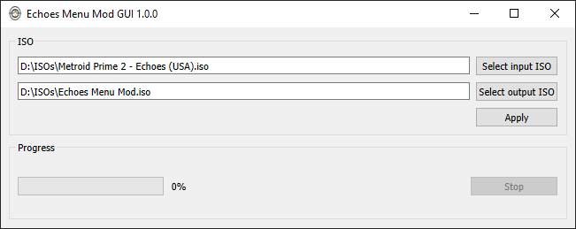

# Echoes Menu Mod GUI
This is a GUI front end for patching Metroid Prime 2: Echoes game ISOs with the
[Menu Mod](https://www.dropbox.com/s/yhqqafaxfo3l4vn/Echoes%20Menu.7z) practice tool made
by [Claris](https://www.twitch.tv/claris).

Menu Mod is a game modification that allows you to warp to any room in the game, modify your equipment and change
room state. For more details, see the
[Menu Mod README](https://www.dropbox.com/s/yhqqafaxfo3l4vn/Echoes%20Menu.7z?file_subpath=%2FEchoes+Menu%2Freadme.txt).  

## Installation

### Windows

In the [releases page](https://github.com/henriquegemignani/echoes-menu-mod-gui/releases) we have zip files
with everything ready to use. Just extract and run!
